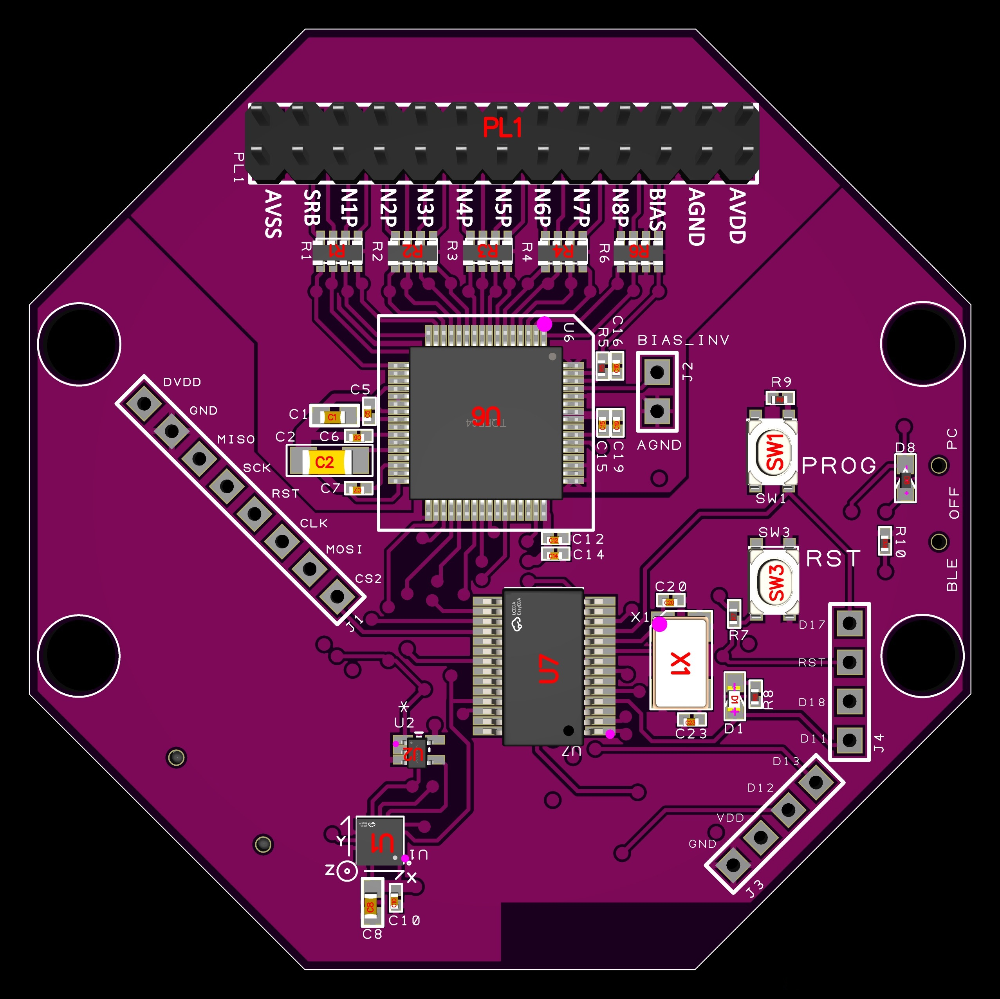
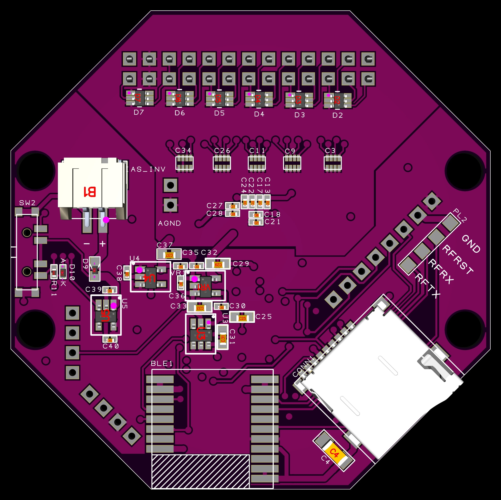

# Custom OpenBCI Cyton Board

A custom implementation of the OpenBCI Cyton biosensing board with enhanced features and modifications for specific research applications.

## Overview

This project presents a custom version of the popular OpenBCI Cyton 8-channel biosensing board. Our implementation includes modifications and improvements while maintaining compatibility with the original OpenBCI ecosystem and software tools.

## Features

- **8-channel EEG/EMG/ECG acquisition** - High-quality biosignal recording
- **24-bit ADC resolution** - Precise signal digitization
- **250 Hz sample rate** - Suitable for most biosignal applications
- **Bluetooth connectivity** - Wireless data transmission
- **Custom modifications** - [Describe your specific modifications here]
- **OpenBCI GUI compatible** - Works with existing OpenBCI software
- **Arduino programmable** - Customizable firmware development

## PCB Design

### Front View

*Front view of the custom OpenBCI Cyton PCB showing component placement*

### Back View  

*Back view of the custom OpenBCI Cyton PCB showing routing and ground planes*

## Hardware Specifications

| Parameter | Specification |
|-----------|---------------|
| Input Channels | 8 differential |
| ADC Resolution | 24-bit |
| Sample Rate | 250 SPS |
| Input Impedance | >1GΩ |
| CMRR | >110 dB |
| Microcontroller | [Specify your MCU] |
| Wireless | [Specify your wireless module] |
| Power Supply | 3.3V - 12V |
| Dimensions | [Add dimensions] |

## Getting Started

### Prerequisites

- OpenBCI GUI software
- Arduino IDE (for firmware development)
- [List any specific drivers or software requirements]

### Hardware Setup

1. **Power Connection**
   - Connect power supply (3.3V-12V) to the designated power input
   - Ensure proper polarity

2. **Electrode Connection**
   - Connect your electrodes to the 8 input channels
   - Use proper electrode gel for good signal quality
   - Connect reference and bias electrodes

3. **Wireless Pairing**
   - [Add specific pairing instructions for your wireless implementation]

### Software Setup

1. **Install OpenBCI GUI**
   ```bash
   # Download from OpenBCI website or install via package manager
   ```

2. **Configure Board Settings**
   - Set board type to "Cyton" in OpenBCI GUI
   - Configure sample rate and channel settings
   - Test connection and signal quality

## Firmware Development

### Building the Firmware

```bash
# Clone the repository
git clone https://github.com/yourusername/custom-openbci-cyton.git
cd custom-openbci-cyton

# Open in Arduino IDE
# Select appropriate board and port
# Upload firmware
```

### Custom Modifications

[Describe any firmware modifications you've made, such as:]
- Custom signal processing algorithms
- Modified communication protocols
- Additional sensor integrations
- Power management improvements

## Usage Examples

### Basic EEG Recording

```python
# Example Python code for data acquisition
import openbci

board = openbci.OpenBCICyton('/dev/ttyUSB0')
board.start_streaming(callback)
```

### Real-time Signal Processing

[Add examples of how to use your custom board for specific applications]

## Bill of Materials (BOM)

| Component | Part Number | Quantity | Description |
|-----------|-------------|----------|-------------|
| [Component 1] | [Part #] | [Qty] | [Description] |
| [Component 2] | [Part #] | [Qty] | [Description] |
| ... | ... | ... | ... |

## Assembly Instructions

1. **SMD Component Placement**
   - Place all SMD components first
   - Use proper soldering techniques for fine-pitch components

2. **Through-hole Components**
   - Install headers and connectors
   - Ensure proper alignment

3. **Testing and Validation**
   - Power-on test
   - Continuity checks
   - Signal quality verification

## Modifications from Original Design

[Describe the key differences between your custom board and the original OpenBCI Cyton:]

- **Hardware Changes**: [List component changes, layout modifications, etc.]
- **Firmware Changes**: [Describe software modifications]
- **Performance Improvements**: [Quantify any improvements]
- **Additional Features**: [List new capabilities]

## Testing and Validation

### Signal Quality Tests

- Input noise measurements
- CMRR verification
- Frequency response analysis
- Channel crosstalk testing

### Compatibility Tests

- OpenBCI GUI compatibility
- Third-party software integration
- Electrode interface testing

## Troubleshooting

### Common Issues

**Board not connecting**
- Check power supply
- Verify wireless pairing
- Confirm driver installation

**Poor signal quality**
- Check electrode connections
- Verify impedance levels
- Review grounding setup

**Firmware upload issues**
- Confirm board selection in Arduino IDE
- Check USB/serial connection
- Verify bootloader functionality

## Contributing

We welcome contributions to this project! Please:

1. Fork the repository
2. Create a feature branch
3. Make your changes
4. Submit a pull request

### Development Guidelines

- Follow existing code style
- Include appropriate documentation
- Test thoroughly before submitting
- Update README if needed

## License

This project is licensed under the MIT License - see the [LICENSE](LICENSE) file for details.

## Acknowledgments

- OpenBCI team for the original design and ecosystem
- [List any other contributors or inspirations]
- Research institutions or funding sources

## Contact

- **Project Lead**: [Your Name] - [email]
- **Repository**: [GitHub URL]
- **Issues**: [GitHub Issues URL]
- **Discussions**: [GitHub Discussions URL]

## Changelog

### Version 1.0.0 (Current)
- Initial release
- [List key features and improvements]

### Future Releases
- [Planned improvements]
- [Feature roadmap]

---

**Disclaimer**: This is a custom implementation and may not be identical to the original OpenBCI Cyton board. Use at your own risk and ensure compliance with relevant regulations for your application.